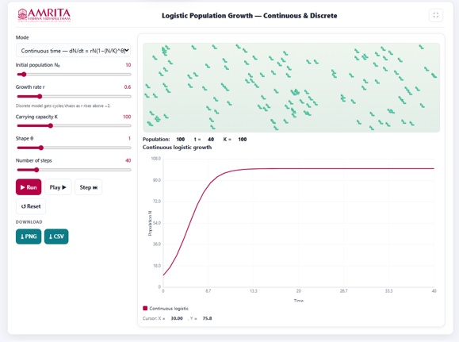

### Procedure

1. The simulator generates a logistic population growth curve corresponding to the selected model and parameter values. Users can observe the temporal changes in population size, examine how the population approaches the carrying capacity, and compare the behaviour of continuous and discrete logistic growth under different simulation conditions.
 
&nbsp;

2. The simulator enables users to investigate population growth under both continuous and discrete logistic growth models. Users can configure the model parameters, execute the simulation, visualize changes in population size over time, and compare the effects of different growth conditions on population dynamics.
 
&nbsp;

3. The simulator consists of a parameter panel on the left and a visualization panel on the right displaying the population animation and the corresponding growth curve.

 
&nbsp;

4. Select the simulation mode from the drop-down menu. Choose either the Continuous logistic growth model or the Discrete logistic growth model, depending on the type of population dynamics to be investigated.

 
&nbsp;

5. Specify the initial population size (N₀) using the corresponding slider. This parameter defines the number of individuals present at the beginning of the simulation.
 
&nbsp;

6. Adjust the intrinsic growth rate (r) using the Growth rate slider. The growth rate determines the rate at which the population increases under ideal environmental conditions. For the discrete model, increasing the growth rate beyond a threshold may produce oscillatory or chaotic population dynamics.
 
&nbsp;

7. Set the carrying capacity (K) using the corresponding slider. The carrying capacity represents the maximum population size that the environment can sustainably support.
 
&nbsp;

8. Specify the shape parameter (θ) using the Shape slider. This parameter influences the form of density-dependent regulation and modifies the approach of the population towards the carrying capacity.
 
&nbsp;

9. Set the total number of simulation steps using the Number of steps slider. This parameter determines the duration of the simulation and the total number of computational iterations.
 
&nbsp;

10. After configuring all model parameters, click the Run button to execute the simulation. The simulator computes the population growth trajectory using the selected model and displays the corresponding graphical output.
 
&nbsp;

11. Alternatively, click the Play button to visualize the simulation continuously or click the Step button to advance the simulation one iteration at a time, allowing detailed observation of the population changes during each computational step.

 
&nbsp;

12. Observe the animation panel displayed above the graph. The animation provides a visual representation of the simulated population, illustrating changes in the number of individuals throughout the simulation.
 
&nbsp;

13. Examine the population statistics displayed above the graph, including the Population, simulation time (t), and carrying capacity (K). These values are updated as the simulation progresses and summarize the current state of the population.
 
&nbsp;

14. Observe the Continuous Logistic Growth graph displayed below the animation panel. The graph illustrates the variation in population size (N) with respect to time, enabling visualization of the logistic growth pattern. Interpret the X-axis (Time) to determine the progression of the simulation and the Y-axis (Population, N) to examine changes in population size throughout the simulation period.
 
&nbsp;

15. Observe the shape of the growth curve and compare the initial phase of rapid population increase with the later phase, where the growth rate gradually decreases as the population approaches the carrying capacity.
 
&nbsp;

16. Identify the point at which the population stabilizes. This indicates that the population has reached an equilibrium state where population growth is balanced by density-dependent environmental limitations.
 
&nbsp;

17. Move the cursor over the graph, if required, to view the corresponding coordinate values displayed beneath the graph. These values provide the population size at a specific simulation time.
 
&nbsp;

18. Modify one or more model parameters, such as the initial population size (N₀), intrinsic growth rate (r), carrying capacity (K), shape parameter (θ), or the number of simulation steps, and execute the simulation again to examine their influence on the population growth trajectory.
 
&nbsp;

19. If required, click the Reset button to restore the default parameter values before performing another simulation.
 
&nbsp;

20. Download the simulation results by clicking the PNG button to save the graphical output as an image or the CSV button to export the numerical simulation data for further analysis.
 
&nbsp;

21.	Repeat the above procedure using different combinations of growth rates, carrying capacities, initial population sizes, and simulation modes to investigate their influence on logistic population growth and compare the characteristics of continuous and discrete population models.

&nbsp;

