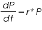
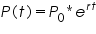
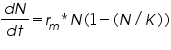
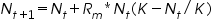

### Theory

### Carrying Capacity (K):
The maximum population size that an environment can sustain indefinitely, given the available resources such as food, habitat, water, and other necessities.

#### Introduction to Logistic Growth
Logistic growth models describe how a population grows in an environment with limited resources and intraspecific competition (competition among individuals of the same species). Unlike exponential growth, which assumes unlimited resources, logistic growth slows as the population approaches the environment's carrying capacity.

This type of growth produces an S-shaped curve (sigmoid curve). Initially, the population grows exponentially, but as resources become limited, the growth rate slows and eventually levels off.

"Logistic models are density-dependent, where the growth rate equals the birth rate minus the death rate." — Stone, 1980

&nbsp;

#### Exponential Growth Model (Unlimited Resources)
When resources are unlimited, population growth is proportional to the current population:

P: Population size

t: Time

r: Intrinsic rate of growth

The solution to this differential equation is:

where P0P_0P0 is the initial population.

&nbsp;

#### Logistic Growth Model (Limited Resources)
As the population grows and resources become limited, the growth rate decreases:

N: Population size

r: Maximum per capita growth rate

K: Carrying capacity

This logistic model accounts for the slowing of growth as population size N approaches K.

&nbsp;

#### Graphical Representation

Exponential Growth (Magenta Curve): Grows without bound.

Logistic Growth (Orange Curve): Grows initially like exponential but slows down as it nears carrying capacity K.

As N≪KN, the logistic and exponential models behave similarly. As N→K, the growth rate approaches zero.

&nbsp;

#### Logistic Equation Dynamics

The logistic equation resembles a parabolic function and can exhibit complex dynamics, especially in discrete form. It has been historically important in understanding biological population growth (Verhulst, 1845). Kingsland (1980s) discussed its applications, successes, and failures in ecology.

&nbsp;

##### 1. Discrete Logistic Growth

In discrete time steps, the logistic growth equation is:

Nt: Current population

Nt+1: Next generation population

Rm: Maximum growth rate

K: Carrying capacity

Alternate interpretation in terms of biological traits:

K= R−1\a 

R: Intrinsic rate of increase

a: Susceptibility to crowding

&nbsp;

##### 2. Continuous Logistic Growth

In continuous time, the logistic equation becomes:

This model assumes a continuous reproduction process, where the reproduction rate decreases linearly with population size.

