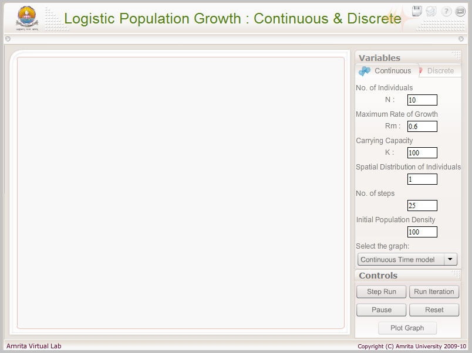
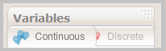
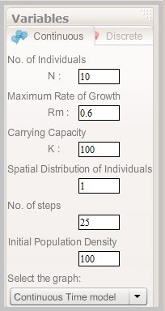
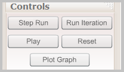
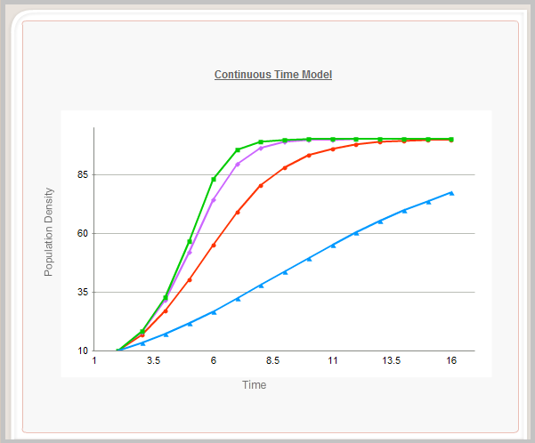
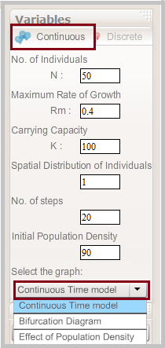
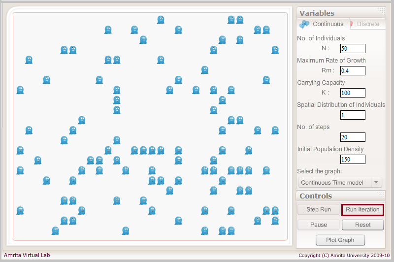
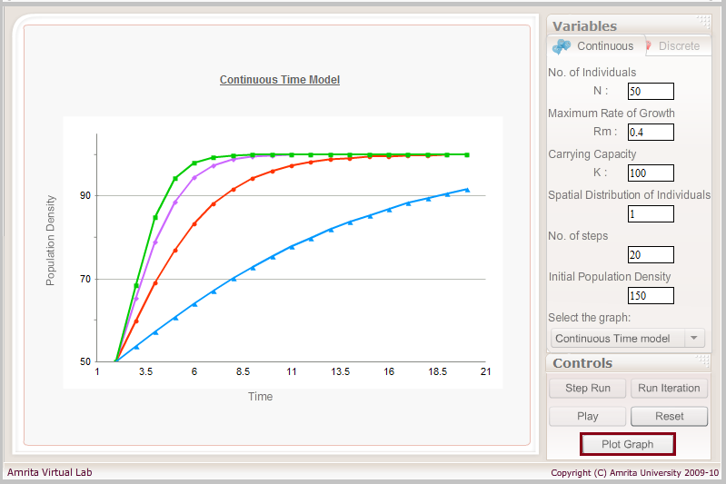

### Procedure

The screen shot of the simulator is as shown below.

&nbsp;

 

The simulator consists of three regions: the simulator's viewable window, the variables menu and the simulation control menu.

&nbsp;
 
#### The Variables Menu:

The variables menu section consists of two sub tabs for the simulation of Continuous and Discrete growth model.

&nbsp;

 

 

Both of the Continuous and Discrete growth models have its own parameters.

 

The variable menu for the Continuous Growth model is as shown below.
 

&nbsp;

 

 
The values entered in the 'Variables' Menu of both the models are default values. User can change the values for the parameters according to the data to be tested. The parameters model includes: No. of individuals (N), Maximum rate of growth (Rm), Carrying Capacity (K), Spatial distribution of individuals, No. of steps and initial pupation density.

&nbsp;

 
#### Simulation control menu:

&nbsp;

 

These set of buttons are used for controlling the simulation. This buttons include: Step Run, Run Iteration, Play/Pause, Reset as well as button for plotting the graph. ‘Step Run' button is meant for manually running the simulator, step by step.  ‘Run Iterations', as the literal word meaning runs the simulator slowly each step by step with the same previously entered values repeatedly till the T time, can also be paused in between to get the values at the corresponding, desired time. 'Play/pause' button as in all cases is for pausing (and continuing) the simulator at any step needed while performing Iterations (slowly, repeatedly calculating the population possible in each step). The 'Reset' button resets the simulator to the default values.

&nbsp;

 
#### Viewable window (Result display window):
 

The simulated values for the parameters are interspersed as graphs in this window.

&nbsp;

 
#### Step by Step explanation:
 

##### Step 1:
Open the simulator and enter the values for the parameters in the variable window. By default, the selected option is Continuous growth model. Click on the drop down menu to select the graph. Continuous Time Model is the default graph option. User can change the option according to the graph to be plotted.

 

&nbsp;

 

##### Step 2:
Click on the ‘Run Iteration’ button to simulate the model.

&nbsp;
 

 

##### Step 3:
Click on the ‘Plot Graph’ button to plot the results. The graph will be shown in the Result display window.

&nbsp;

 

Once you complete the procedures, press the reset button of the simulation control window, to reset all parameters to its initial/default values.

 

 